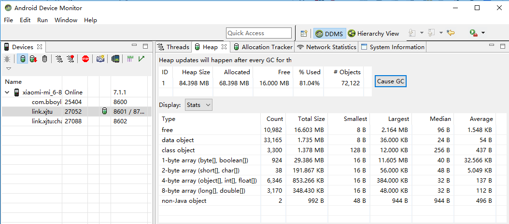

### 1. 绘制优化
---

几个概念：
* 双缓冲机制：UI总是在back buffer中绘制，然后再与front buffer交换
* VSYNC:通知CPU刷新视图的定时信号
* 三缓冲机制：比双缓冲减少了卡顿，增加了延迟（绘制的一帧要过32ms在显示）
* 绘制方法分：软件绘制（CPU）和硬件加速(GPU)，CPU负责包括Measure，Layout，Record，Execute的计算操作，GPU负责Rasterization(栅格化)操作。

检测工具：
* profile GPU rendering寻找有问题的页面：蓝色代表绘制时间。
* traceview查看方法耗时:主要关注`calls+recur calls/total`（调用次数）和`cpu time/call`（方法耗时）
* hierarchy viewer检测布局深度

布局优化方法：
* 减少布局层级：
    * 合理使用relativelayout和linearlayout
    * 用merge代替根布局（某些情况下可用，例如top bar）
* 提高显示速度：使用viewstub，只有设置为visiable以及调用inflate()的时候布局才会被加载和实例化。注意viewstub只能加载一次，也就是说viewstub对象会被置为空，之后不能再通过viewstub控制其布局。
* 布局复用（include属性等）

过度绘制：
* 检测工具：手机->开发者选项->show gpu overdraw
    * 蓝色：多绘制了1次，大片蓝色是可以接受的
    * 绿色：多绘制两次
    * 淡红：多绘制3次，不超过屏幕的1/4是可接受的
    * 深红：多绘制了4次及以上。严重影响性能，需要优化。
* 如何避免：
    * 布局：降低层级，减少不必要背景。
    * 自定义view：`canvas.quickReject()`快速判断是否需要绘制，`canvas.clipRect()`避免绘制越界。

启动优化：
* 冷启动：创建一个新的进程，创建并初始化application实例，创建和初始化mainActivity实例。热启动：直接创建和初始化mainActivity实例
* 启动耗时检测：
    * `adb shell am start -W [packageNName]/[packageName.AppstartActivity]` 执行后得到thisTime,TotalTime（创建进程+application初始化+activity初始化到界面显示）,WaitTime。
    * 代码打点：TimeMonitor

### 2. 内存优化
---

GC类型：
* kGcCauseForAlloc：分配内存时发现内存不够引起的GC，会stop the world
* kGcCauseBackground：内存达到一定阈值时触发的GC，后台GC，不会stop the world
* kGcCauseExplicit：显式调用时进行的GC，如果ART打开了这个选项，在system.gc()时会进行GC

GC日志：
```
11-17 10:19:45.257: D/dalvikvm(22511): GC_EXPLICIT freed 14K, 52% free 3715K/7687K, external 7372K/9177K, paused 25ms
```
其格式为：`[GC原因] [释放了多少VM内存], [VM堆内存统计], [外部内存统计], [VM暂停时间]`表示本次为显式GC，回收了14KB内存，回收后52%的内存可用，存活的对象大小为3715KB,堆大小是7687KB，external同理是指native memory，存放位图数据或者堆以外内存之类的。GC暂停了25ms

其中GC原因分这么几类：
* `GC_CONCURRENT` : 堆内存上涨时避免因堆内存满了而触发GC
* `GC_FOR_MALLOC` : 由于concurrent gc没有执行完，又需要分配更多的内存，这时不得不停下来进行malloc gc
* `GC_EXTERNAL_ALLOC` : 为external分配的内存执行的GC
* `GC_HPROF_DUMP_HEAP` : 创建一个HPROF profile时执行
* `GC_EXPLICIT` : 显式调用了system.gc()

内存分析工具：
* memory monitor ：Android studio 3.0开始被替代为android profiler。从view->tool windows->android profiler，可以查看CPU，memory，network等信息。
* heap viewer : 在tools->android->android device monitor

* allocation tracker : 入口和heap viewer位置邻近，方便追踪内存分配情况，并记录调用栈。

内存泄漏：
* MAT检测 ：
    * 先下载MAT客户端
    * 在Android device monitor（DDMS）处dump HPROF file
    * hprof-conv转格式：dalvik->J2SE
    * MAT打开转换后的HPROF文件

### 3. 存储优化：
---

